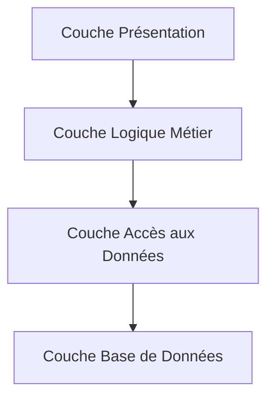

# Architecture N-Tier pour un Projet de Gestion Hospitalière

## Structure de l'Architecture N-Tier

L'architecture N-Tier (ou multi-couches) est une approche de conception logicielle qui divise une application en plusieurs couches distinctes, chacune ayant une responsabilité spécifique. Voici les principales couches adaptées à un projet de gestion hospitalière :

1. **Couche Présentation (UI/Client)**  
    - Interface utilisateur pour les patients, médecins, et administrateurs.  
    - Technologies courantes : HTML, CSS, JavaScript, frameworks comme React, Angular.  
    - Fonctionnalités : prise de rendez-vous, consultation des dossiers médicaux, gestion des horaires.

2. **Couche Logique Métier (Business Logic)**  
    - Contient les règles métier spécifiques au domaine hospitalier.  
    - Implémentée avec des langages comme Java, C#, Python.  
    - Fonctionnalités : gestion des patients, planification des rendez-vous, facturation, gestion des stocks médicaux.

3. **Couche Accès aux Données (Data Access)**  
    - Gère les interactions avec la base de données hospitalière.  
    - Utilise des ORM (Entity Framework, Hibernate) ou des requêtes SQL.  
    - Fonctionnalités : récupération des dossiers médicaux, mise à jour des informations des patients, gestion des inventaires.

4. **Couche Base de Données (Database)**  
    - Stocke les données sensibles et critiques comme les dossiers médicaux, les informations des patients, et les données administratives.  
    - Bases de données relationnelles (MySQL, PostgreSQL) ou NoSQL (MongoDB).  
    - Sécurisation des données pour respecter les normes de confidentialité (ex. : RGPD, HIPAA).

### Diagramme de l'Architecture



## Instructions d'Installation et de Configuration

### Prérequis
- **IDE** : Visual Studio, IntelliJ IDEA, ou VS Code.  
- **Serveur Web** : Apache, Nginx, ou un serveur intégré (Spring Boot, ASP.NET Core).  
- **Base de Données** : MySQL, PostgreSQL, ou MongoDB.  
- **Outils de Gestion des Dépendances** : Maven, Gradle, ou npm.

### Étapes d'Installation
1. **Clonez le dépôt** :  
   ```bash
   git clone https://github.com/votre-repo/gestion-hospitaliere.git
   cd gestion-hospitaliere
   ```

2. **Configurez la Base de Données** :  
   - Créez une base de données et importez le fichier `schema.sql` ou `schema.json`.  
   - Mettez à jour les informations de connexion dans le fichier de configuration (`application.properties` ou `.env`).

3. **Installez les Dépendances** :  
   - Pour la couche présentation :  
     ```bash
     cd frontend
     npm install
     ```
   - Pour la couche logique métier :  
     ```bash
     cd backend
     mvn install
     ```

4. **Lancez l'Application** :  
   - Couche présentation :  
     ```bash
     npm start
     ```
   - Couche logique métier :  
     ```bash
     mvn spring-boot:run
     ```

## Exemples d'Utilisation de l'API

### Prendre un Rendez-vous
**Requête** : `POST /api/rendezvous`  
**Corps de la Requête** :  
```json
{
  "patientId": 123,
  "medecinId": 456,
  "date": "2023-10-15T10:00:00"
}
```

**Réponse** :  
```json
{
  "status": "success",
  "message": "Rendez-vous confirmé",
  "rendezvousId": 789
}
```

### Consulter les Dossiers Médicaux
**Requête** : `GET /api/dossiers?patientId=123`  
**Réponse** :  
```json
[
  {
    "dossierId": 1,
    "diagnostic": "Grippe",
    "date": "2023-09-01"
  },
  {
    "dossierId": 2,
    "diagnostic": "Fracture",
    "date": "2023-08-15"
  }
]
```

## Avantages de l'Architecture N-Tier pour la Gestion Hospitalière

- **Modularité** : Chaque couche peut être développée et maintenue indépendamment.  
- **Scalabilité** : Les couches peuvent être déployées sur des serveurs séparés pour gérer une charge importante.  
- **Sécurité** : Les données sensibles sont mieux protégées grâce à une séparation claire des responsabilités.  
- **Réutilisabilité** : Les composants peuvent être réutilisés pour d'autres projets dans le domaine de la santé.

## Exemple de Flux

1. Un patient envoie une requête pour prendre un rendez-vous via l'interface utilisateur.  
2. La couche logique métier vérifie la disponibilité des médecins et applique les règles métier.  
3. La couche d'accès aux données interagit avec la base de données pour enregistrer le rendez-vous.  
4. Une confirmation est renvoyée au patient via la couche présentation.
